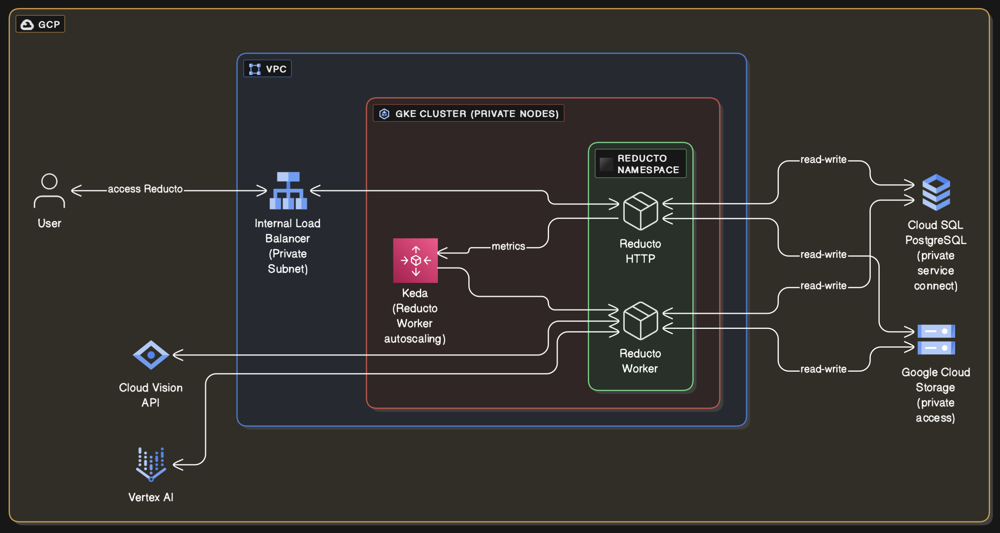

# Reducto

Deploy Reducto on Google Kubernetes Engine using Terraform




### Credentials 

Use one of the methods:

#### 1. Application Default Credentials

```
gcloud auth application-default login
```

#### 2. OAuth Access Token

For Terraform to use your [gcloud credentials](https://registry.terraform.io/providers/hashicorp/google/latest/docs/guides/provider_reference#access_token-1), run:

```
gcloud auth login
export GOOGLE_OAUTH_ACCESS_TOKEN=$(gcloud auth print-access-token)
```

### Billing Project

By default `var.project_id` is also billing project. This can be overriden by `var.billing_project_id`. Billing project is required for creating Cloud Vision API key.

See [Quota Management Configuration](https://registry.terraform.io/providers/hashicorp/google/latest/docs/guides/provider_reference#quota-management-configuration) in Terraform provider configuration.

### Quota

In your region, ensure there's sufficient quota for [Compute Optimized](https://cloud.google.com/compute/docs/compute-optimized-machines) instances (CPUs per region, CPU family per region), and Cloud Vision API https://console.cloud.google.com/iam-admin/quotas


### Security

A GKE cluster is provisioned with private nodes without public IP. Postgres instance is provisioned in private network without public IP.

GKE control plane is provisioned with both public and private IP - but access is limited to VPC and CIDR provided in `var.control_plane_allowed_cidrs`

### Terraform 

At a minimum create a `terraform.tfvars` with following configuration:

```terraform
project_id                 = "your-gcp-project"
reducto_host               = "reducto.yourdomain.com"
reducto_helm_chart_version = "..."
reducto_helm_repo_username = "your-username"
reducto_helm_repo_password = "your-password"
```

And then:

```sh
terraform init
terraform plan
terraform apply
```

### DNS 

Ensure that domain name in `var.reducto_host` resolves to IP of internal load balancer of Reducto Ingress.

### Notes on Destroy

On `terraform destroy` you may get following error, to resolve it manually delete from VPC under "VPC network peering" tab, and rerun `terraform destroy`.

<details>
<summary>
Service Networking Connection
</summary>

```
│ Error: Unable to remove Service Networking Connection, err: Error waiting for Delete Service Networking Connection: Error code 9, message: Failed to delete connection; Producer services (e.g. CloudSQL, Cloud Memstore, etc.) are still using this connection.
```
</details>