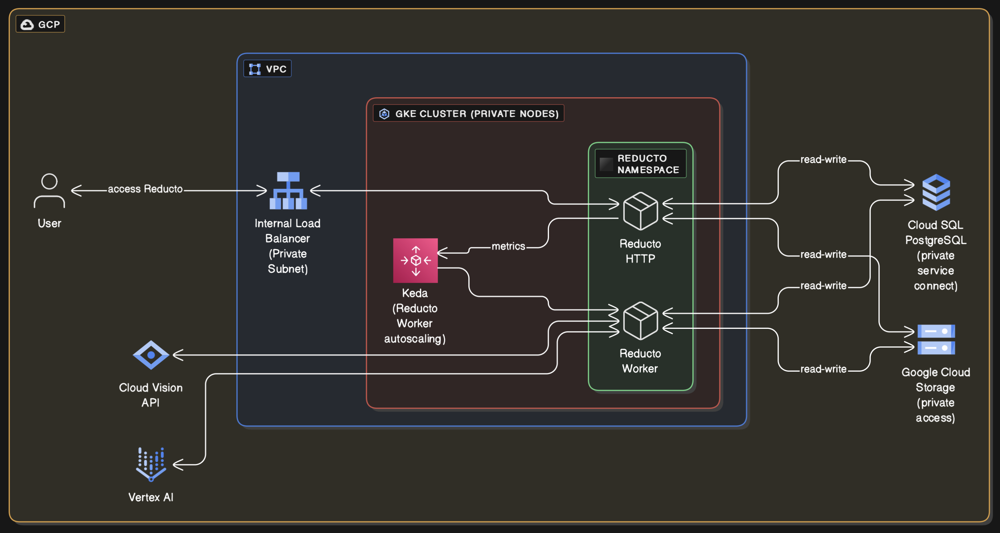

# Reducto

Deploy Reducto on Google Kubernetes Engine using Terraform




### Credentials 

Use one of the methods:

#### 1. Application Default Credentials

```
gcloud auth application-default login
```

#### 2. OAuth Access Token

For Terraform to use your [gcloud credentials](https://registry.terraform.io/providers/hashicorp/google/latest/docs/guides/provider_reference#access_token-1), run:

```
gcloud auth login
export GOOGLE_OAUTH_ACCESS_TOKEN=$(gcloud auth print-access-token)
```

### Billing Project

By default `var.project_id` is also billing project. This can be overriden by `var.billing_project_id`. Billing project is required for creating Cloud Vision API key.

See [Quota Management Configuration](https://registry.terraform.io/providers/hashicorp/google/latest/docs/guides/provider_reference#quota-management-configuration) in Terraform provider configuration.

### Quota

In your region, ensure there's sufficient quota for [Compute Optimized](https://cloud.google.com/compute/docs/compute-optimized-machines) instances (CPUs per region, CPU family per region), and Cloud Vision API https://console.cloud.google.com/iam-admin/quotas


### Security

A GKE cluster is provisioned with private nodes without public IP. Postgres instance is provisioned in private network without public IP.

GKE control plane is provisioned with both public and private IP - but access is limited to VPC and CIDR provided in `var.control_plane_allowed_cidrs`

### Terraform 

#### Terraform State

To use a bucket for Terraform state, create a bucket and update `backend.tf`.

OR you can skip this to quickly run Terraform plan and apply with locally managed `terraform.tfstate` state file for testing purposes.

#### Plan and Apply

At a minimum create a `terraform.tfvars` with following configuration:

```terraform
project_id                 = "your-gcp-project"
reducto_host               = "reducto.yourdomain.com"
reducto_helm_chart_version = "..."
reducto_helm_repo_username = "your-username"
reducto_helm_repo_password = "your-password"

enable_managed_redis = true
```

And then:

```sh
terraform init

# Required once in a new project. GKE's module queries available versions
# during planning, so its API must be active before the first full plan.
terraform apply -target=google_project_service.services

terraform plan
terraform apply
```

For an existing deployment, preserve the current Cloud SQL application
password by supplying the sensitive `database_password` input before applying
this update. Leaving it null generates a password only for a fresh deployment.
Never rotate this value as part of adding managed Redis or changing Terraform
ownership.

The default chart version is `1.12.6`. Its optional queue workers remain disabled by
default. When `enable_managed_redis` is true, Terraform provisions Memorystore
for Redis over Private Service Access with AUTH and in-transit encryption,
creates the `reducto-redis-ca` Secret from Memorystore's private CA, and passes
the TLS URL and chart `redis.tls.*` settings to the release. The bundled Redis
deployment remains disabled. Chart `1.12.6` now feature-detects traffic
distribution, but the explicit `PreferClose` override remains because managed
control planes in the 1.31–1.33 range accept `PreferClose` while
`PreferSameZone` requires newer API versions; `dnsConfigNoAAAA: false` also
remains for this portable dual-stack deployment.

## New Reducto Architecture bridge (chart 1.12.6)

For the v1.12.6 → v1.13 migration, pin the chart, provision Memorystore, and
layer the queue worker topology through `reducto_extra_values_files`. Keep the
legacy worker enabled during the bridge and start every rollout ratio at `0`;
follow the migration runbook for the full drain and ramp procedure.

```hcl
reducto_helm_chart_version = "1.12.6"
enable_managed_redis       = true
reducto_extra_values_files = ["redis-queue-bridge.yaml"]
```

The CPU worker reserves 14 CPU and 26Gi; size the customer node pool to fit
that reservation before enabling the bridge.

`redis-queue-bridge.yaml`:

```yaml
env:
  WORKER_PROVIDER: STREAQ_LOCAL
  PARSE_STREAQ_TRAINABLE_ROLLOUT_RATIO: "0"
  PARSE_STREAQ_NON_TRAINABLE_ROLLOUT_RATIO: "0"
  STREAQ_CPU_WORKER_ROLLOUT_PCT: "0"
  STREAQ_CPU_COMPLETION_TRAINABLE_ROLLOUT_PCT: "0"
  STREAQ_CPU_COMPLETION_NON_TRAINABLE_ROLLOUT_PCT: "0"
streaqWorkers:
  io:
    enabled: true
    workerName: io
  cpu:
    enabled: true
    workerName: cpu
    useFullImage: true
    workerCount: 1
    replicaCount: 1
    kedaScaler: false
    resources:
      requests:
        cpu: 14
        memory: 26Gi
      limits:
        memory: 26Gi
worker:
  enabled: true
```

### DNS 

Ensure that domain name in `var.reducto_host` resolves to IP of internal load balancer of Reducto Ingress.

### Notes on Destroy

To delete, set `deletion_protection = false` and run `terraform destroy`. You may get following error, to resolve it manually delete from VPC under "VPC network peering" tab, and rerun `terraform destroy`.

<details>
<summary>
Service Networking Connection
</summary>

```
│ Error: Unable to remove Service Networking Connection, err: Error waiting for Delete Service Networking Connection: Error code 9, message: Failed to delete connection; Producer services (e.g. CloudSQL, Cloud Memstore, etc.) are still using this connection.
```
</details>
